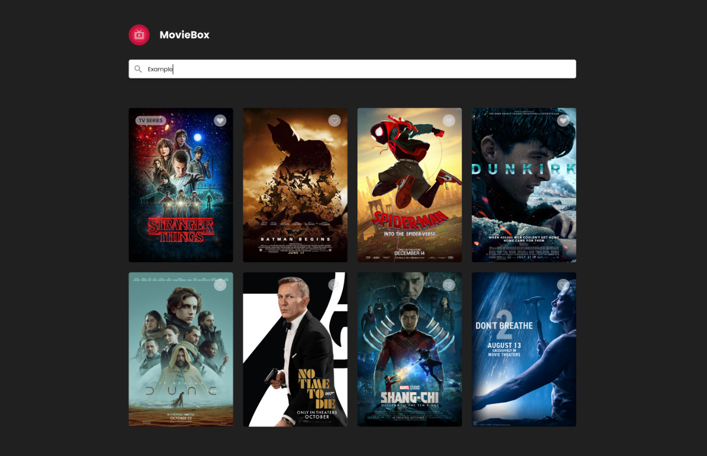

# MovieBox

### MovieBox is a project where you can search for your favorite movies and see their details



## Technologies I have used

* React
* ViteJS
* React Query
* Zustand
* Axios
* Sass
* Cypress

## Setup

```bash
$ cd ./interview
$ npm install
$ npm run dev
```

### To run the tests

`
$ npm run dev
`

And in another console run the command

`
$ npm run test
`

## Features

* Search a movie
* See the details of the movie
* Leave movie comments

### To Do:

* Being able to add movies as favorites
* Have a section of favorite movies

